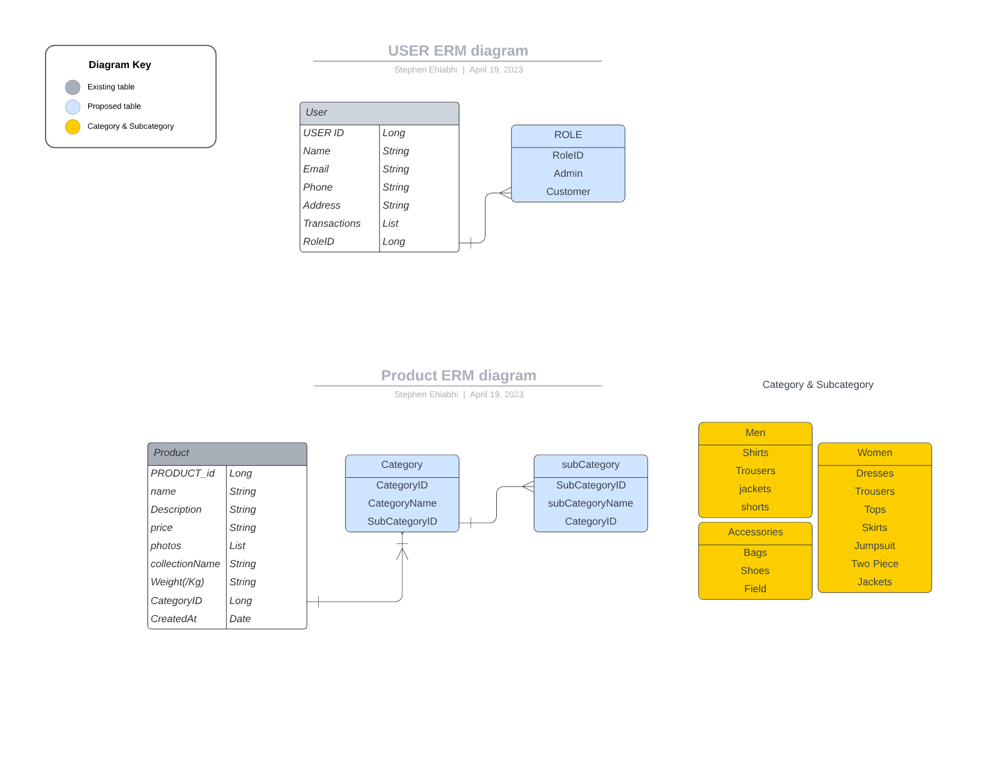

Database ERM architecture

[//]: # (todo: Add security, add login routes, add the payments service responsible for payments via the stripe api, create a customer, create a card in stripe and charge the card using 

[//]: # (the card id- in order service, and adding a product and price to stripe&#41;)
[//]: # (dont use static tokens or api keys in production)